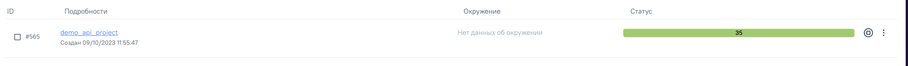
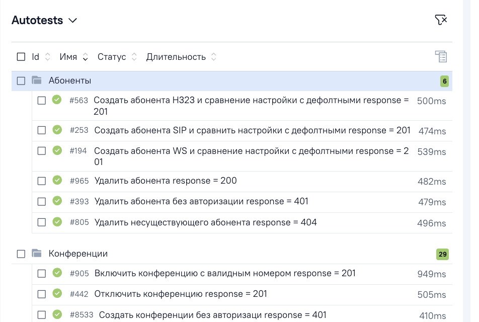
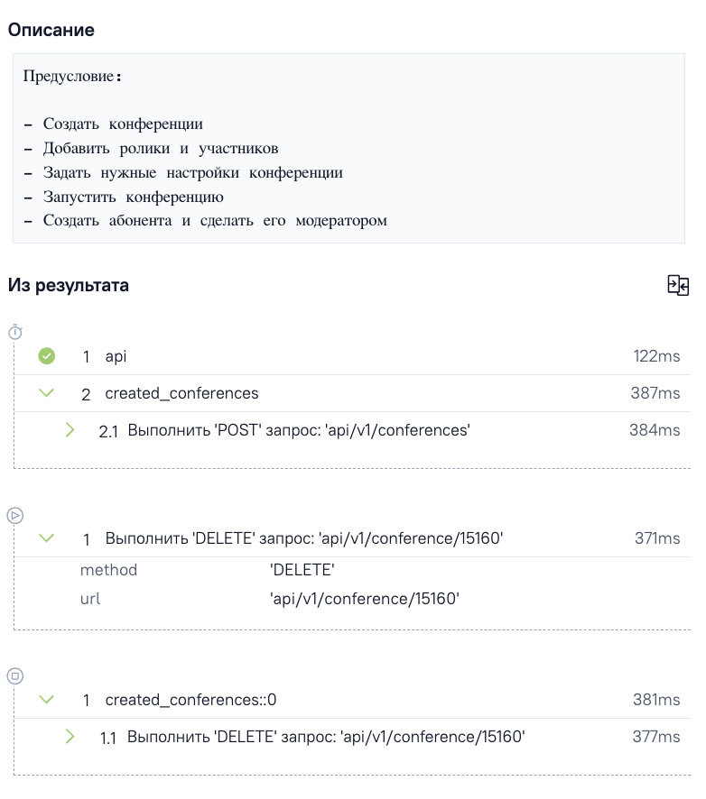
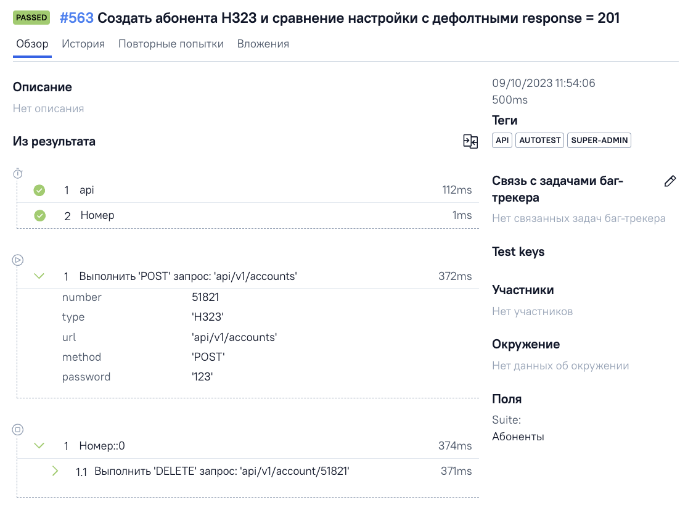

# demo_api_test
Несколько тестов и структура рабочего проекта по тестированию api

    - Содержит несколько тестов для примера структуры проекта по тестированию api
    - Тестировании комплекса продуктов на одной основе - api запросы выносятся в отдельный проект как
        и добавляются в качестве submodule git
        
### Переменные окружения для библиотеки api и запуска автотестов

- **SERVER_IP**
- **LOGIN**
- **PASSWORD**
- **SECOND_IP**
- **SECOND_LOGIN**
- **SECOND_PASSWORD**

<h3> Allure Report - График прохождения тестов</h3>
    

Открыть скриншот

        
    

    
<h3> Allure Report - отображение тестов в отчете</h3>
    

Открыть скриншот

        
    

 
<h3> Allure Report - тест с шагами и описанием</h3>
    

Открыть скриншот

        
        
    

